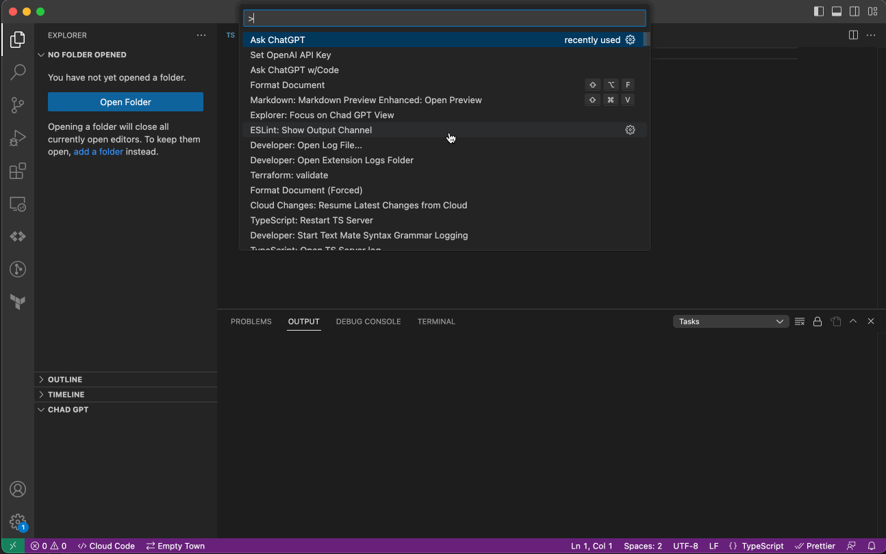

# ChadGPT

**Dead simple** Open AI VSCode integration with progress bar and code inclusion.

## Commands

Activate with Command + Shift + P

* Ask ChatGPT
* Ask GPT w/ Code
  * When selecting this the open file will be included
* Ask GPT w/ Code
  * If you have "selected" code, it will be included

## Modifiers
* Change your model with Command + Shift + P "Set OpenAI AI Model" (Only tested with GPT 3.5 and 4)